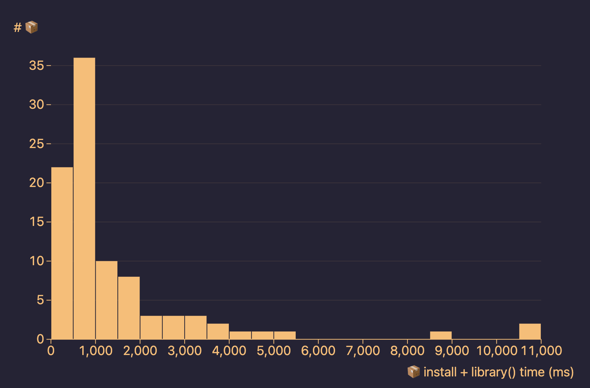

# hrbrmstr's WebR (webR?) Experiments

>Before you read this, please reconsider your life choices and wait for WASM Shiny to support WebR like it does Pyodide if you really want Reactive apps.
>
>If you're still reading, also consider using React. George (et al.) has an example of that in the docs and in the WebR repo. I despise giant web frameworks and always try to do what I can in VanillaJS and D3 (or Observable) if at all possible. But, I'm also pretty messed up.
>
>If you are _still_ reading, consider [using this awesome WebR Quarto extension](https://github.com/coatless/quarto-webr) instead.
>
>If you are _stil_, _still_ reading, def don't do the "everything in one directory" madness I did on my initially deployed examples. I'll be adding more to this repo to provide a better strategy for managing these projects.

I went bonkers over the release of WebR on Thursday. These are some of my experiments. I'll continue to add some, and also make some that aren't as "toy"ish.
 
They are _not_ complete, working things. Just some stuff to show folks some concepts. But, if you download the various JS and CSS components referenced in the HTML docs, you might be able to get it working before I get a chance to pretty up this whole mess over the next couple days. 

The associated directories are named pretty obviously.

The `file` references are where the code lives. Honesty, you can just view-source in your browser, too.

I was initiall lazy and had like _everything_ in the same directory (WebR, JS, CSS, CSV, etc). That's pretty dumb, but I've only got so much energy these days thanks to everyone in the U.S. pretending the pandemic is over (yay long covid). 

## Days 1 & 2 

`index.html`

Small demo that uses D3 to build a list from R object output — <https://rud.is/webr-d3-demo/>

`pkgs.html`

Plot `mtcars` with Vega-Lite. <https://rud.is/webr-d3-demo/pkgs.html>

The file is named badly (it no longer relies on any R pkgs) but it's too late to change it now

Just showing how to pass data to Vega from R. Chosen b/c Vega is super lightweight and the Vega specs are dope.

`plot.html`

Observable Plot demo — <https://rud.is/webr-d3-demo/plot.html>

- loads {jsonlite} (b/c I was too lazy that day to write a function you'll see in a bit) 
- yanks `mtcars` from R
- reads a CSV from my server
- Uses Observable Plot to make a lot

`plot-moar`

"Reactive" sans React/Shiny demo that also includes WebR reading from a remote CSV — <https://rud.is/webr-d3-demo/plot-moar.html>

The dropdown list is made from R data and the plot and janky table change by pulling the associated data from R each time.

It also includes this JS function to make data frames returned to JS from WebR more user-friendly (it's what I was using {jsonlite} for):

```js
function webRDFToJS(obj) {
  return d3.range(0, obj.values[0].values.length).map((ridx) => {
	let m = {};
	  for (var cidx = 0; cidx < obj.names.length; cidx++) {
		  m[obj.names[cidx]] = obj.values[cidx].values[ridx];
  	}
  	return m;
  });
}
```

I went back and re-added that to these to make them faster.

## Day 3

`index.html` + `support.r`

"Dashboard" b/c someone requested it. — <https://rud.is/webr-dash/no-dplyr.html>

This one uses {dplyr}++ and was originally _super slow_ until George gave me a hack that I'll show in a bit. All the R code for it the support file.

R does tons more heavy lifting in this, and there are JS wrappers to WebR calls to pull things from R. Def a poor dude's Shiny/React setup.

`no-dplyr.html` + `support-no-dplyr.r`

Same Dashboard but it's much faster, but that's kind of meaningless b/c the both load stupid fast now.

## Day 4 (git [submodule](https://git-scm.com/book/en/v2/Git-Tools-Submodules) `webr-app` in this repo)

Made a full on, non-janky app with instructions on how to install webr site-wide. 

<https://github.com/hrbrmstr/webr-app>

## Day???? 

`webr-pkgs/`

The `webr-pkgs/` directory contains another small WebR-powered application that shows how to wrap an R function for calling from JS. You can [see it in action](https://rud.is/w/webr-pkgs/) before reading.

Essentially, the app makes a live call to `base::available.packages()` from WebR and spits out a [Grid.js](https://gridjs.io/) table.

```plain
├── css
│   ├── app.css               # app-specific CSS and alot of CSS for our Grid.js table
│   └── simple.min.css        # an easy to use CSS framework
├── index.html                # main app page
├── main.js                   # our apps' main module
├── modules
│   ├── rsupport.js           # wrappers for things in "support.r"
│   ├── webr-app.js           # app logic functions
│   └── webr-helpers.js       # utility functions to work with WebR objects
├── r
│   └── support.r             # Our JS app's "R library"
├── webr-serviceworker.js     # Part of WebR
├── webr-serviceworker.js.map # helps DevTools find symbols
├── webr-worker.js            # Part of WebR
└── webr-worker.js.map        # helps DevTools find symbols
```

First, I tweaked the config to show how you can move the `.*serviceworker.*` files along for the ride with your apps. This is reflected in `main.js`:

```js
globalThis.webR = new WebR({
	WEBR_URL: "/webr/",
	SW_URL: "/w/webr-pkgs/"
}); 
```

Next, `r/support.r` and `modules/support.js` are paired files (I've removed the JSDoc comments from `support.js` for brevity, here):

```r
get_webr_packages <- function() {
  ap <- available.packages(repos = "https://repo.r-wasm.org/", type = "source")
  ap <- as.data.frame(ap)
  ap[, c("Package", "Version", "License")]
}
```

```js
import * as HelpR from "./webr-helpers.js"

export async function getWebrPackages(ctx) {
	return (Promise.resolve(await HelpR.evalRToJs(ctx, 'get_webr_packages()')))
}
```

Think of `support.r` as your apps "R library package". Stick functions and data you want available in there. We `base::source()` that in `main.js`:

```js
await HelpR.sourceRScript(globalThis.webR, "https://rud.is/w/webr-pkgs/r/support.r")
```

>NOTE: we could have embedded that R script right into the module as a JavaScript string to avoid another HTTP transaction. I'll show an example of that next time.

After the app is fully initialized, we make a call to populate the Grid.js table:

```js
App.packagesToGrid(globalThis.webR, "tbl");
```

Inside `packagesToGrid()` is the call to `RSupport.getWebRPackages()` (see `webr-app.js` for the whole code):

```js
import * as RSupport from "./rsupport.js";

export async function packagesToGrid(ctx, id) {

	const obj = await RSupport.getWebrPackages(ctx) // 👈🏽 here's where we call our wrapped R code

	const gridObj = webRDataJsDfToGrid(obj); // see `webr-app.js` for how we need to transform the data to work with Grid.js.

	new Grid({
		columns: obj.names,
		data: gridObj,
		pagination: {
			limit: 20,
			summary: true
		},
		fixedHeader: true,
		search: true,
		language: {
			'search': {
				'placeholder': '🔍 📦 Search...'
			}
		}
	}).render(document.getElementById(id));

}
```

`ggwebr/`

This was my (successful!) attempt to figure out how to get stuff from a WebR `canvas` device to an HTML DOM `<canvas>`.

This thing lets you select form 3 {base} `plot()`s. You can play with it here: <https://rud.is/w/ggwebr/>.

I made the mistake of thinking I knew everything and made a dumb, complex, ggplot2 example. After a series of miserable failures, I decided to see how Balamuta did it in Quarto WebR and learned _just enough_ to be dangerous. There are lots of annotations in `main.js` about this.

I also _seriously_ reduced the complexity of this to let y'all focus on the plotting thing.

(UPDATE)

I added in the files from {basetheme} and rejiggered the plots a bit.


```plain
ggwebr
├── css
│   ├── app.css                # app-specific; mostly for centering stuff
│   └── simple.min.css         # K.I.S.S.
├── index.html                 # SUPER minimal; don't judge my `<center>`s. This is hack code.
├── main.js                    # where the wild things are
├── r
│   ├── basetheme.R						 # from {basetheme}
│   ├── coltools.R             # from {basetheme}
│   ├── themes.R               # from {basetheme}
│   └── utils.R                # from {basetheme}
├── webr-serviceworker.js      #
├── webr-serviceworker.js.map  #
├── webr-worker.js             # I'm planning on always keeping these close so if I'm ever
└── webr-worker.js.map         # in need of shoving some app somewhere where I need to rely on CDN WebR, I can do it superfast.
```

### 2023-03-18

`pkgbenchmarks`



I have an example of using {ggplot2} in WebR (VanillaJS) coming, but after making that, I had a question about WebR and performance as it relates to loading and using WASM R packages, and it sent me down a rabbit hole.

The `pkgbenchmarks/` has only two files, and is described in [this blog post](https://rud.is/b/?p=13824&preview=true).

```plain
├── index.html
└── style.css
```

TL;DR: most packages load and `library()` in well-under one second. Some — like {ggplot2} — are monsters.

### Headers

IT IS REALLY IMPORTANT TO GO HERE AND READ IT: <https://docs.r-wasm.org/webr/latest/serving.html>

I'm kind of new to web workers, but know abt shared array buffers and these HTTP server headers are SUPER IMPORANT b/c they make WebR apps 10-100x faster to load, esp if you use pkgs.

```plain
Cross-Origin-Opener-Policy: same-origin
Cross-Origin-Embedder-Policy: require-corp
```

Also, this `Cache-Control` heading appears to help keep things under `/webr` (YMMV) in the browser cache longer, and will also let any ISP or enterprise proxies keep the files in their caches as well:

```plain
Cache-Control: public, max-age=604800
```

## "Pro"tips

Yeah, "pro". _Sure._ More like "hrbrhacks". 

### Is the fast cross-origin thing working?

```
console.log(`are we cross-origin isolates? ${crossOriginIsolated}`);
```

### LEVELED UP CACHING

If you're hosting the webr tarball locally (please don't give telemetry to any company unless you rly have to) and run nginx, then DO THIS:

```
location ^~ /webr {
  etag on;
  expires max;
  add_header Cache-Control "public, max-age=31536000, immutable";
}
```

You can always unset it, but I've managed to get sub-400ms webR context re-instantiation times with that. First one always has to load up the files.

### Seeing What Packages Are Available

Just:

```
available.packages(repos="https://repo.r-wasm.org/", type="source")
```

from any R session.

### JavaScript Modules

WebR is a [JavaScript module](https://www.w3schools.com/js/js_modules.asp), and you need to make sure that files with an `mjs` extension have a [MIME type](https://developer.mozilla.org/en-US/docs/Web/HTTP/Basics_of_HTTP/MIME_types) of `text/javascript`. A typical way for web servers to know how to communicate this is via a `mime.types` file. That is not true for all web servers, and I'll add steps for ones that use a different way to configure this. The entry should look like this:

```
text/javascript  mjs;
```

### Your DevTools Console Is Also Your R Console

Once WebR is initialized into `globalThis` (that's only one way to do it and that idiom is used in other examples), you can use it in the DevTools console:

```js
let jsobj = await (await globalThis.webR.evalR("mtcars")).toJs()
```

Obviously, you can call anything, and even source random R scripts from the internet (_don't_ do that).

But, it can be handy having R around.